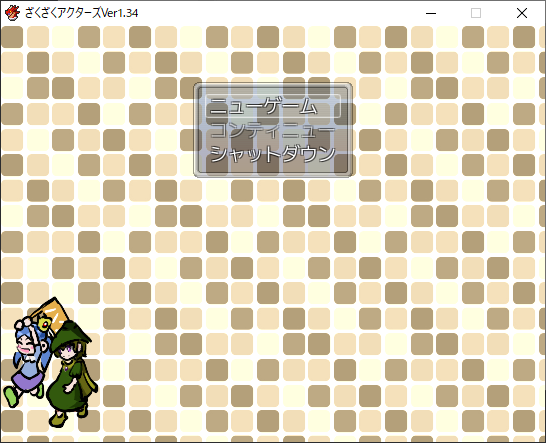

+++
title = "ざくざくアクターズに関して"
date = 2022-12-13
+++

### TL;DR

[Vectorのダウンロードページ](https://www.vector.co.jp/soft/dl/winnt/game/se508809.html)からダウンロードしてプレイしましょう．

### はじめに

この記事は[UEC Advent Calendar 2022](https://adventar.org/calendars/7581)の13日目の記事です．昨日はいずりなさんによる，[【Bash】インタラクティブな選択メニューを作ってみた](https://izurina.dev/post/uec-advent2022/)でした．

現在電通大M1の[toku\_san](https://keybase.io/toku_san/)です．最近学会発表を終えたので，かなり平穏な日々を過ごしています．

この記事では，私が去年からプレイし始めて，いつの間にかハマってしまったゲーム「ざくざくアクターズ」の紹介をしたいと思います．

### 注意

この記事にはざくざくアクターズを始めからプレイして5分くらいすればわかるネタバレと，ゲームのストーリーには全く関係のない技術的なネタバレが存在します．でもそんなものはやネタバレではないので気にせず読み続けてください．

### ゲームの概要

[ざくざくアクターズ](https://www.vector.co.jp/soft/winnt/game/se508809.html)は，[はむすた](https://www.vector.co.jp/vpack/browse/person/an051865.html)氏によって[RPGツクール VX Ace](https://rpgmakerofficial.com/product/products/rpgvxace/index/)で制作されたRPG形式のフリーゲームです．縮めてざくアクとも呼ばれています．

作者ブログによれば，2012年6月19日にバージョン0.71aが公開されました．これがこのゲームの初めての公開となります．その後更新を続け，メインストーリーが完結したあともコンテンツの追加が続き，この記事の執筆当時最新版であるバージョン1.82が2022年10月24日に公開されました．なお，作者ブログにはゲームのネタバレに相当するコンテンツを含まれているため，リンクはこの記事の下部にあります．

製作者のはむすた氏はざくアクの他に，[らんだむダンジョン](https://www.vector.co.jp/soft/winnt/game/se482804.html)というRPGゲームを過去に製作しているほか，[逆さま世界の私達へ](https://www.pixiv.net/novel/series/1449123)という小説も執筆しています．

### ゲームシステムに関して

ざくアクでは原則8人のパーティーを組みます．戦闘にも8人が関わりますが，そのうち4人が前衛として実際の戦闘を行い，残りの4人は後衛として待機します．ただし，いつでもメンバーを前衛あるいは後衛に移すことが可能です．

また，ざくアクでは[TP（Tactical Point）](https://tkool.jp/mv/course/03.html)という概念が存在します．これは戦闘中に様々な状況下でたまるものですが，一部の技能はこれを消費します．

8人制バトルとTPという概念は単独で見ると地味ですが，この2つが組み合わさるとかなり興味深くなります．例えば蘇生技は概してTPを消費するため，そのような技を持ったキャラクターがTPをためたら後衛に配置し，蘇生するタイミングで前衛に戻すといったことが可能になります．またバフ技を大量に掛けて一撃で突破するという方法も考えられます．

難易度は絶妙です．操作キャラクターはかなりの数が登場しますが，得意不得意はキャラクターによって異なるため，キャラクターを使い分けて攻略することが基本となっています．また敵の性質もやはりそれぞれ異なりますが，ゲーム中に攻略のための誘導が存在するため，かなり親切設計になっています．ただし敵味方の特徴を無視したゴリ押しをしようとすると，レベルがいくら高くても死にます（死にました）．

### ストーリーに関して

次に，ゲーム開始直後のナレーションを引用します．

> ……この世界には召喚された物が溢れていた。
>
> いつ頃からか出来上がった召喚という技術は、様々な世界から技術、人、物を運んできたが、この画期的な技術に少々浮かれすぎた人々は、用もないのに多くの人を呼びすぎた。
>
> 結果として、仕事もなく、やることもなく。余ってしまった召喚された側――召喚人達が溢れてしまう。
>
> 彼らは、なんとか世界に馴染もうとの努力はするものの、そう簡単にはいかず、我慢の限界を超えた一部の召喚人達は、暴徒と化して暴れまわった。
>
> これに責任を感じた召喚士達は、暴徒の鎮圧に乗り出したが、あろうことか、鎮圧側の召喚人まで暴徒に肩入れして暴れまくり。
>
> 反乱の規模は広がり続け、その鎮圧に、たくさんの国と人々が疲労しまくった。
>
> 当然、召喚士達の面目は丸つぶれで、これ以降、召喚には大幅な制限がかけられることになったのである。
>
> ……この世界側からみると、一先ず落ち着いたような事件なのだけど、召喚された者にとっては、全くそうではなかった。
>
> 上手く逃げ延びた者、元々暴動騒ぎには興味なかった者。もう一騒ぎ企んでいる者……。まだまだ多数の召喚人が世界には残っている。
>
> 呼び出された世界に不満を持つ彼らと……。そんな彼らをハグレと読んで軽視するこの世界の人々とで、見えない摩擦が物語を動かそうとしていたが――。
>
> ここ辺境の、名前もない遺跡に逃げ込んだ彼女達の事情は、他の奴らとはだいぶ違っていた。

……とまあ，ベースとなる設定はかなり重いと思います．ただしストーリーの全てがこれに関係しているわけではなく，実際2割程度かなと思います．その他は登場人物同士のいざこざ（場合によっては死闘）だったり，父親の暴走によって男の娘が殺されそうになったり，女の子同士によるどつき漫才があったり……．

シリアスな部分はかなり多めですが，そのような展開の中でも時々ネタを突っ込んできたり，雰囲気が柔らかくなるような内容も含まれているので，そこまで辛くありません．絵柄も可愛いですし．

ちなみにこの導入において述べられている「彼女達」は上記のスクリーンショットにある二人の少女たちのことです．青い服の子がデーリッチ，そして緑の服の子がローズマリーです．プレイヤーはデーリッチを操作することになります．

### BGMに関して

このゲームでは特に中盤以降，mozell氏によって作曲されたBGMがいくつか使用されています．また一部のBGMはこのゲームのための書き下ろしです．このBGMですが，それ自体の質が高いのも然ることながら，このBGMはゲームとの非常に親和性が高く，プレイしていてなんか色んな感情が出てきます．

ですからぜひともBGMを鳴らしてプレイしてください．普通そうするでしょうが，僕はBGMを鳴らせなかったのでだいぶ後悔しています．

### 総括

[とにかく面白いので一度ダウンロードしてプレイしてみてください．](https://www.vector.co.jp/soft/winnt/game/se508809.html)

### 付録

#### 付録A：前作「らんだむダンジョン」に関して

前述の通り，ざくアクの製作者であるはむすた氏は，過去にらんだむダンジョン（通称らんダン）というゲームを製作しています．こちらもかなりの大作です．

ざくアクをプレイするにあたってらんダンを予めプレイする必要はありません．ざくアクにはらんダンのネタがいくつか用いられていますが，らんダンをやっていないからといって，ざくアクのストーリーが全く解らなくなるということはありません．それでももし時間があればらんダンもプレイすることをおすすめします．ざくアクの前にやっても，あとにやっても構いません．らんダン自体面白いですし，ざくアクに含まているネタがわかって結構楽しいです．

#### 付録B：各ウェブサイトへのリンク

リンク先はゲームのネタバレが含まている場合があります．　

- [はむすたブログ](http://blog.livedoor.jp/hamusuta_rpg/)
- [はむすた氏のTwitterアカウント](https://twitter.com/hamusuta_zakuak)
- [もぜ園](https://mozeen.com/)
- [mozell氏のTwitterアカウント](https://twitter.com/mozeen_mozell)

#### 付録C：Linuxでのプレイに関して

[Wine](https://www.winehq.org/)を用いればざくアクをLinuxでプレイすることはできますが，私自身は一部のBGMを再生させることができず，結局Windows上で動かすことにしました．

ざくアクには[WMA形式](https://ja.wikipedia.org/wiki/Windows_Media_Audio)の音源が用いられていますが，この形式で保存されているBGMを鳴らすことができませんでした．Wineでは2022年2月11日に公開された[バージョン7.2](https://www.winehq.org/announce/7.2)でWMAデコーダの開発が開始されたばかりなため，あくまで推測ですが，まだWMAを直接鳴らすことが出来ないのかなと考えています．従って素直にWindows上でプレイするほうが得策だと思います．

幸いにして，電通大の学生は[無料で個人PCにWindowsをインストールすることができます](https://www.cc.uec.ac.jp/ug/ja/license/ms/personal/kivuto/index.html)．これを利用するのも一つの手です．実際これ以外にも，例えば授業中にWindowsでしか動かないソフトウェアの利用を強いられることがありますし，Windowsマシンは一台あったほうが良いです．

**Wineを利用したことによるトラブルや不具合に関してゲームの製作者に問い合わせないでください．Wineの使用は開発側の想定環境ではありません．**
