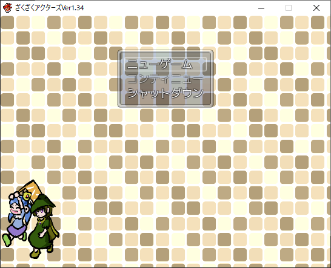

+++
title = "ざくざくアクターズに関して"
date = 2022-12-13
+++

### TL;DR

[Vectorのダウンロードページ](https://www.vector.co.jp/soft/dl/winnt/game/se508809.html)からダウンロードしてプレイしましょう．

### はじめに

この記事は[UEC Advent Calendar 2022](https://adventar.org/calendars/7581)の13日目の記事です．

現在電通大M1の[toku\_san](https://keybase.io/toku_san/)です．

### 注意

この記事にはざくざくアクターズを始めからプレイして15分くらいすればわかるネタバレと，ゲームのストーリーには全く関係のない技術的なネタバレが存在します．でもそんなものはやネタバレではないので気にせず読み続けてください．

### 概要

[ざくざくアクターズ](https://www.vector.co.jp/soft/winnt/game/se508809.html)は，[はむすた](https://www.vector.co.jp/vpack/browse/person/an051865.html)氏によって[RPGツクール VX Ace](https://rpgmakerofficial.com/product/products/rpgvxace/index/)で制作されたRPGゲームです．縮めてざくアクとも呼ばれています．

作者ブログによれば，2012年6月19日にバージョン0.71aが公開されました．これがこのゲームの初めての公開となります．その後更新を続け，メインストーリーが完結したあともコンテンツの追加が続き，この記事の執筆当時最新版であるバージョン1.82が2022年10月24日に公開されました．なお，作者ブログにはゲームのネタバレに相当するコンテンツを含まれているため，リンクはこの記事の下部にあります．

製作者のはむすた氏はざくアクの他に，[らんだむダンジョン](https://www.vector.co.jp/soft/winnt/game/se482804.html)というRPGゲームを過去に製作しているほか，[逆さま世界の私達へ](https://www.pixiv.net/novel/series/1449123)という小説も執筆しています．

### ゲームシステムに関して

ざくアクでは原則8人のパーティーを組みます．戦闘にも8人が関わりますが，そのうち4人が前衛として実際の戦闘を行い，残りの4人は後衛として待機します．ただし，いつでもメンバーを前衛あるいは後衛に移すことが可能です．

また，ざくアクでは[TP（Tactical Point）](https://tkool.jp/mv/course/03.html)という概念が存在します．これは戦闘中に様々な状況下でたまるものですが，一部の技能はこれを消費します．

8人制バトルとTPという概念は単独で見ると地味ですが，この2つが組み合わさるとかなり興味深くなります．例えば蘇生技は概してTPを消費するため，そのような技を持ったキャラクターがTPをためたら後衛に配置し，蘇生するタイミングで前衛に戻すといったことが可能になります．またバフ技を大量に掛けて一撃で突破するという方法も考えられます．

### 前作「らんだむダンジョン」に関して

前述の通り，ざくアクの製作者であるはむすた氏は，過去にらんだむダンジョン（通称らんダン）というゲームを製作しています．こちらもかなりの大作です．

ざくアクをプレイするにあたってらんダンを予めプレイする必要はありません．ざくアクにはらんダンのネタがいくつか用いられていますが，らんダンをやっていないからといって，ざくアクのストーリーが全く解らなくなるということはありません．それでももし時間があればらんダンもプレイすることをおすすめします．ざくアクの前にやっても，あとにやっても構いません．らんダン自体面白いですし，ざくアクに含まているネタがわかって結構楽しいです．

### Linuxでのプレイに関して

[Wine](https://www.winehq.org/)を用いればざくアクをLinuxでプレイすることはできますが，私自身は一部のBGMを再生させることができず，結局Windows上で動かすことにしました．

ざくアクには[WMA形式](https://ja.wikipedia.org/wiki/Windows_Media_Audio)の音源が用いられていますが，この形式で保存されているBGMを鳴らすことができませんでした．Wineでは2022年2月11日に公開された[バージョン7.2](https://www.winehq.org/announce/7.2)でWMAデコーダの開発が開始されたばかりなため，あくまで推測ですが，まだWMAを直接鳴らすことが出来ないのかなと考えています．従って素直にWindows上でプレイするほうが得策だと思います．

幸いにして，電通大の学生は[無料で個人PCにWindowsをインストールすることができます](https://www.cc.uec.ac.jp/ug/ja/license/ms/personal/kivuto/index.html)．これを利用するのも一つの手です．実際これ以外にも，例えば授業中にWindowsでしか動かないソフトウェアの利用を強いられることがありますし，Windowsマシンは一台あったほうが良いです．

**Wineを利用したことによるトラブルや不具合に関してゲームの製作者に問い合わせないでください．Wineの使用は開発側の想定環境ではありません．**
